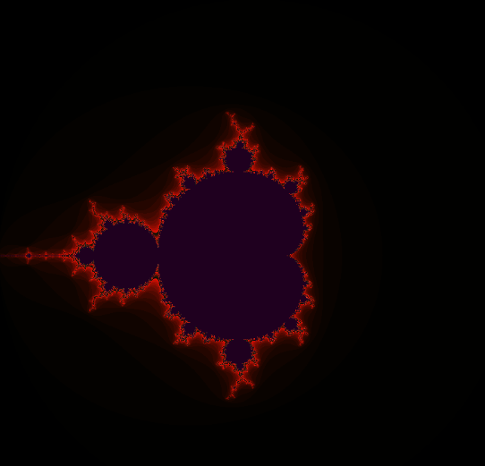
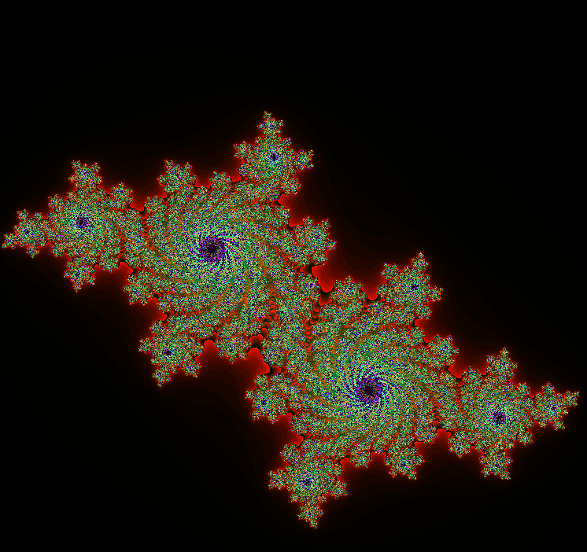
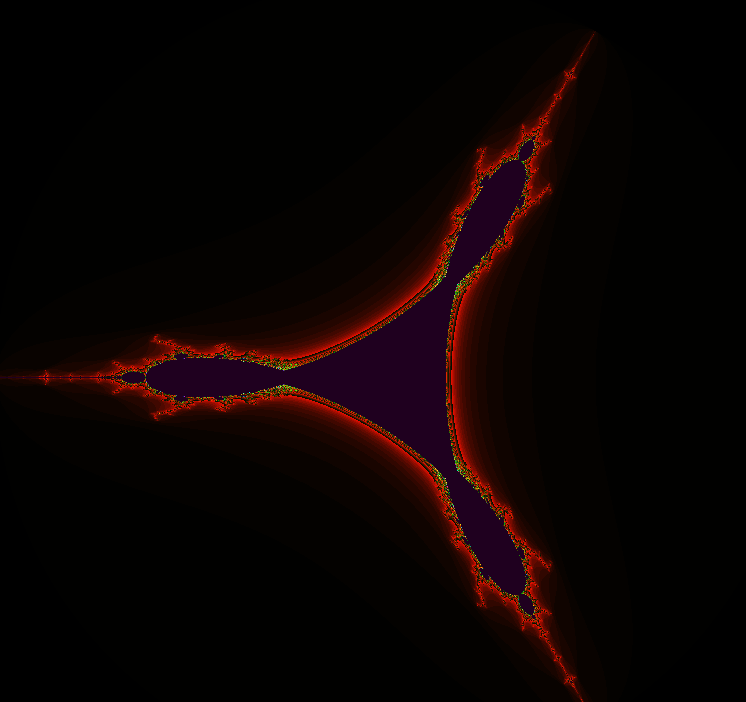

# fract-ol

An interactive **fractal renderer** written in **C** using **MiniLibX**.
This project visualizes famous fractals such as the **Mandelbrot**, **Julia**, and **Tricorn** sets, allowing **real-time zooming**, **panning**, and **iteration depth control**.

---

## 🧠 Concept

Fractals are generated by iterating a **complex function** for each point on the complex plane.
Each pixel on the screen represents a complex number `c = x + yi`. The fractal algorithm iteratively applies a function to determine whether the point escapes to infinity or remains bounded.

For example, the **Mandelbrot set** uses:

[
z_{n+1} = z_n^2 + c
]
starting from ( z_0 = 0 ).

The **Julia set** uses the same recurrence, but `c` is fixed and the initial value `z_0` corresponds to the pixel position.

The **Tricorn** (a variant of Mandelbrot) uses:
[
z_{n+1} = \overline{z_n}^2 + c
]
where (\overline{z_n}) is the **complex conjugate** of (z_n).

Each pixel’s color is determined by the number of iterations before escape (|z| > 2). Points that never escape are usually colored black or dark blue.

---

## 🖥️ Features

* Real-time rendering using MiniLibX.
* Smooth zoom centered on the mouse position.
* Panning with arrow keys.
* Adjustable iteration depth for detail/performance balance.
* Support for **Mandelbrot**, **Julia**, and **Tricorn** fractals.
* Graceful exit and help message for invalid arguments.

---

## 🧩 Supported fractals

| Name           | Formula               | Description                                               |
| -------------- | --------------------- | --------------------------------------------------------- |
| **Mandelbrot** | zₙ₊₁ = zₙ² + c        | Classic Mandelbrot set (based on `c` from pixel position) |
| **Julia**      | zₙ₊₁ = zₙ² + c        | Julia set for a fixed constant `c` given by command-line  |
| **Tricorn**    | zₙ₊₁ = (conj zₙ)² + c | Inverted version of Mandelbrot using conjugation          |

---

## ⚙️ Installation and Requirements

### 🧾 Prerequisites

* **Linux (X11 environment)** – this version uses `minilibx-linux`.
* **Your own libft** library (42 standard library).
* X11 and related libraries installed (`Xext`, `Xrender`, `Xrandr`, `Xi`, `Xcursor`, `dl`, `pthread`, `m`).

> ⚠️ For **macOS**, MiniLibX uses a different API (`mlx_macos`) and linking flags.
> The code would require changes to event handling and includes (e.g. `mlx.h` paths and keycodes).
> This repository is built **only for Linux**.

---

### 🔧 Setup

```bash
# Clone repository
git clone https://github.com/hroxo/fract-ol.git
cd fract-ol

# Build libft (you must have your own)
cd /path/to/your/libft
make
cd -  # back to fract-ol directory

# Build MiniLibX (Linux)
cd minilibx-linux
make
cd ..

# Edit Makefile if needed to point to your libft path
# Example:
# LIBFT_DIR = /path/to/your/libft

# Compile fract-ol
make
```

This produces a binary called `fractol`.

---

## 🚀 Usage

```bash
./fractol mandelbrot
./fractol julia <real> <imag>
./fractol tricorn
./fractol --help
```

Examples:

```bash
./fractol mandelbrot
./fractol julia -0.8 0.156
```

If invalid arguments are provided:

```
Wrong input use --help to view options
```

---

## 🎮 Controls

| Key / Mouse        | Action                                      |
| ------------------ | ------------------------------------------- |
| Scroll Up          | Zoom in (centered on cursor)                |
| Scroll Down        | Zoom out                                    |
| ← ↑ ↓ →            | Pan around the fractal                      |
| Right Click        | Increase iteration count (more detail)      |
| Left Click         | Decrease iteration count (faster rendering) |
| Q                  | Reset view and iterations                   |
| ESC / Window Close | Exit program                                |

---

## 🧮 How it Works

1. **Mapping pixels to the complex plane**

   Each pixel `(x, y)` on the screen corresponds to a complex number:
   [
   c_{re} = min_{re} + \frac{x}{WIDTH} \times (max_{re} - min_{re})
   ]
   [
   c_{im} = max_{im} - \frac{y}{HEIGHT} \times (max_{im} - min_{im})
   ]

   This mapping is done in `map_values()`.

2. **Iteration**

   For each pixel, the function (depending on the fractal) is iterated up to a maximum number of times (`iter`), or until `|z|² > escape²`.

   ```c
   while (iter < max_iter && (z_re * z_re + z_im * z_im) <= esc_sq) {
       // fractal formula (varies)
       iter++;
   }
   ```

3. **Color Encoding**

   The final pixel color depends on the number of iterations performed before escaping.
   Smooth coloring could be added later, but currently colors are mapped directly using `encode_color()`.

4. **Rendering**

   * Each pixel is drawn into a memory buffer using `my_mlx_pixel_put()`.
   * After the full image is computed, it is displayed with:

     ```c
     mlx_put_image_to_window(fractol->mlx, fractol->win, fractol->img.img, 0, 0);
     ```
   * The process repeats after every zoom, pan, or iteration change.

---

## 🧱 Project Structure

| File          | Description                                                           |
| ------------- | --------------------------------------------------------------------- |
| `main.c`      | Handles argument parsing and program initialization                   |
| `init.c`      | Sets up MiniLibX, window, image, and event hooks                      |
| `hook_func.c` | Mouse and keyboard event handling (zoom, pan, etc.)                   |
| `render.c`    | Core rendering loop for Mandelbrot, Julia, Tricorn                    |
| `math.c`      | Complex math utilities (`map_values`, `encode_color`, `calc_z`, etc.) |
| `exit.c`      | Clean exit, freeing MLX and showing help/errors                       |
| `util.h`      | Global definitions, structures, constants, keycodes                   |
| `Makefile`    | Build instructions for fract-ol (links libft + MiniLibX)              |

---

## ⚡ Performance

* Iterations are the main performance cost.

  * Higher iteration → more detail, slower.
  * Lower iteration → less detail, faster.
* Uses an off-screen buffer for drawing before displaying (double buffering).
* Compiles with `-O3` for optimized floating-point performance.

---

<p align="center">
  
  
  
</p>
